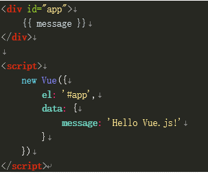
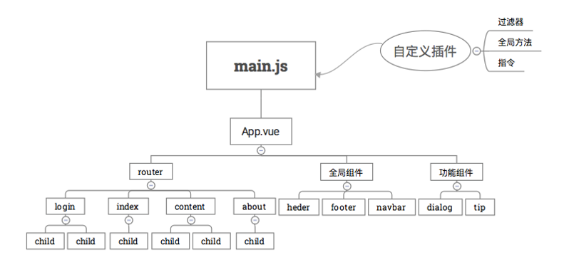
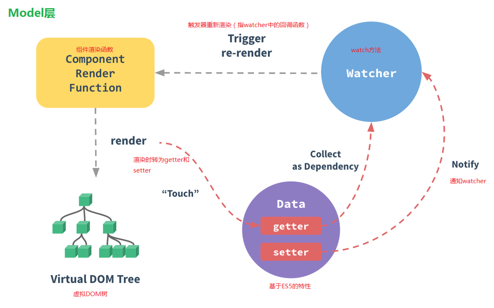

#快速上手Vue

前述

    1. 目标是通过本文，快速了解Vue的基本原理和使用它进行简单的开发
    2. 只需要html、css、js基础即可（原理涉及ES5，ES6，但对开发者来说不是必须要学的）
    3. 这是根据我内部分享的PPT改写的


目录

    1. 概述
    2. 原理
    3. 快速上手
    4. 其他Vue常见功能
    5. 使用Vue写一个大型页面

###**1、概述**

Vue的优点：

1. 轻量——最小只需要17.14kb（Vue.js 2.0生产版本）—— jquery是87KB（3.1）95KB（1.12）
2. 易学——相比较React和Angular来说，学习曲线平缓
3. 易开发——支持热加载（即修改源代码后，无需刷新即可在页面上看到效果）

<p><p>

使用Vue的项目：

1. 天猫、饿了么、小米商城、途牛、苏宁易购、微博头条
2. 其中某些使用了vue-native，也就是weex（比单纯前端多了后端部分）

<p><p>

几个典型特点：

1.数据驱动

    1. jQuery和常规mvc编程的核心思想是dom操作，先有dom然后再操作。
    2. Vue的核心思想是数据驱动，dom是为了数据服务的，数据可以生成dom、控制dom

2.生命周期

    1. 创建时： 创建 → 绑定变量 → 挂载 → 模板编译 → 插入页面
    2. 摧毁时： 摧毁前→摧毁后

3、封装

    1. 在开发中，html、css、js共同组成一个Vue的组件；
    2. 相同组件的多次复用，不同组件被组合成一个更大的Vue实例；
    3. 上一级Vue实例不直接对下级Vue实例进行修改，而是通过接口；
    4. 组件的三级：中间可以根据不同端来调用不同的组件。
       * 整个网站
       * 单个页面
       * 页面的某个模块（如登录）
    5. 因此Vue.js先天具有封装、继承的特性，这是面向对象编程的重要特点。

4、单向/双向绑定

    单向：修改变量message的值，html里显示的内容自动变化。
    双向：针对input标签。
    利用的是setter和getter（es5）特性
    


###**2、原理**

项目结构：



开发环境 → 生产环境的过程：


内部实现原理：



###**3、快速上手**

####**新建Vue实例**

```
1、创建一个Vue实例：
    先引入Vue.js文件，然后new一个Vue的实例即可。如下面的代码，通过<script src="./vue.js"></script>引入，然后在<script>标签中创建实例

2、挂载
    在Vue的实例里，通过传递的el属性

3、单向/双向绑定
    data属性里的变量 = html标签里的{{}} = input标签里的v-model
```

```html
<!DOCTYPE html>
<html lang="en">
<head>
    <meta charset="UTF-8">
    <title>DEMO</title>
    <script src="./vue.js"></script>
</head>
<body>
<div id="app">
    <input v-model="test"/>
    {{test}}
</div>
<script>
    new Vue({   //创建一个Vue的实例  
        el: "#app", //挂载点是id="app"的地方
        data: {     //数据
            test: "abc"     //变量test
        }
    })
</script>
</body>
</html>
```


####**Vue实例解释**

1. 将内容作为Vue实例的参数，创建的时候以对象的形式作为参数传递
2. 常见内容有：

```
1. 变量被放在对象的data属性中，类型是对象（有时候是函数，通过函数返回值获取）；
2. 挂载点被放在el属性中，类型是字符串；
3. 方法被放在methodss属性中，类型是对象；
4. 创建时执行内容被放在created属性中，类型是函数；
5. 子组件被放在components属性中，类型是对象 
```

####**Dom控制**

1. 在使用jQuery的时候，我们需要手动添加dom、删除dom，修改dom内容；
2. 在Vue的时候，我们需要更换思维方式，用变量去控制dom；
3. 具体而说：

```
1. 单个dom的添加/删除/显示/隐藏——变量控制
2. 多个在显示上互斥的dom（如登录时的提示）—— 用１个变量去控制
3. 多个同类型dom（用v-for来动态生成）
```

示例页面：

```
http://www.jianwangsan.cn/ppt/dom%E6%93%8D%E4%BD%9C.html
```