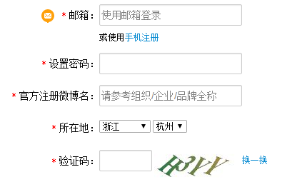
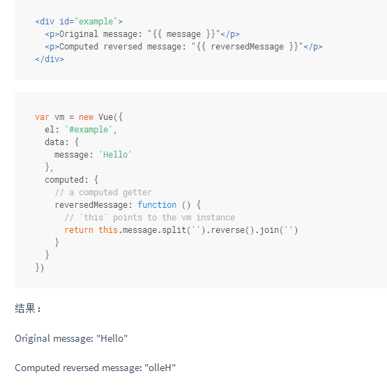
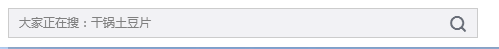
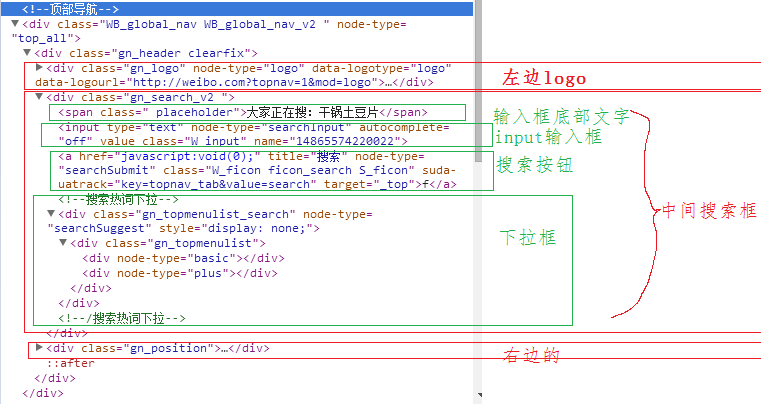

#快速上手Vue

前述

    1. 目标是通过本文，快速了解Vue的基本原理和使用它进行简单的开发
    2. 只需要html、css、js基础即可（原理涉及ES5，ES6，但对开发者来说不是必须要学的）
    3. 这是根据我内部分享的PPT改写的


目录

    1. 概述
    2. 原理
    3. 快速上手
    4. 其他Vue常见功能
    5. 使用Vue写一个大型页面

###**1、概述**

Vue的优点：

1. 轻量——最小只需要17.14kb（Vue.js 2.0生产版本）—— jquery是87KB（3.1）95KB（1.12）
2. 易学——相比较React和Angular来说，学习曲线平缓
3. 易开发——支持热加载（即修改源代码后，无需刷新即可在页面上看到效果）

<p><p>

使用Vue的项目：

1. 天猫、饿了么、小米商城、途牛、苏宁易购、微博头条
2. 其中某些使用了vue-native，也就是weex（比单纯前端多了后端部分）

<p><p>

几个典型特点：

1.数据驱动

    1. jQuery和常规mvc编程的核心思想是dom操作，先有dom然后再操作。
    2. Vue的核心思想是数据驱动，dom是为了数据服务的，数据可以生成dom、控制dom

2.生命周期

    1. 创建时： 创建 → 绑定变量 → 挂载 → 模板编译 → 插入页面
    2. 摧毁时： 摧毁前→摧毁后

3、封装

    1. 在开发中，html、css、js共同组成一个Vue的组件；
    2. 相同组件的多次复用，不同组件被组合成一个更大的Vue实例；
    3. 上一级Vue实例不直接对下级Vue实例进行修改，而是通过接口；
    4. 组件的三级：中间可以根据不同端来调用不同的组件。
       * 整个网站
       * 单个页面
       * 页面的某个模块（如登录）
    5. 因此Vue.js先天具有封装、继承的特性，这是面向对象编程的重要特点。

4、单向/双向绑定

    单向：修改变量message的值，html里显示的内容自动变化。
    双向：针对input标签。
    利用的是setter和getter（es5）特性
    


###**2、原理**

项目结构：


开发环境 → 生产环境的过程：


内部实现原理：


###**3、快速上手**

####**新建Vue实例**

```
1、创建一个Vue实例：
    先引入Vue.js文件，然后new一个Vue的实例即可。如下面的代码，通过<script src="./vue.js"></script>引入，然后在<script>标签中创建实例

2、挂载
    在Vue的实例里，通过传递的el属性

3、单向/双向绑定
    data属性里的变量 = html标签里的{{}} = input标签里的v-model
```

```html
<!DOCTYPE html>
<html lang="en">
<head>
    <meta charset="UTF-8">
    <title>DEMO</title>
    <script src="./vue.js"></script>
</head>
<body>
<div id="app">
    <input v-model="test"/>
    {{test}}
</div>
<script>
    new Vue({   //创建一个Vue的实例  
        el: "#app", //挂载点是id="app"的地方
        data: {     //数据
            test: "abc"     //变量test
        }
    })
</script>
</body>
</html>
```


####**Vue实例解释**

1. 将内容作为Vue实例的参数，创建的时候以对象的形式作为参数传递
2. 常见内容有：

```
1. 变量被放在对象的data属性中，类型是对象（有时候是函数，通过函数返回值获取）；
2. 挂载点被放在el属性中，类型是字符串；
3. 方法被放在methodss属性中，类型是对象；
4. 创建时执行内容被放在created属性中，类型是函数；
5. 子组件被放在components属性中，类型是对象 
```

####**Dom控制**

1. 在使用jQuery的时候，我们需要手动添加dom、删除dom，修改dom内容；
2. 在Vue的时候，我们需要更换思维方式，用变量去控制dom；
3. 具体而说：

```
1. 单个dom的添加/删除/显示/隐藏——变量控制
2. 多个在显示上互斥的dom（如登录时的提示）—— 用１个变量去控制
3. 多个同类型dom（用v-for来动态生成）
```

示例页面：
http://www.jianwangsan.cn/ppt/dom%E6%93%8D%E4%BD%9C.html

代码：
https://github.com/qq20004604/quickly-start-vuejs/blob/master/dom%E6%93%8D%E4%BD%9C.html

####**input相关**

1. 前端输入内容大部分都是通过input标签，Vue可以完美兼容。
2. 例如，微博的注册页面如下图：


3. 使用jQuery的情况下，流程如下：  
    Dom→值→验证→（正确）提交→（错误）显示错误提示Dom 

4. 在Vue中，核心思想是数据驱动，因此，input标签需要绑定的值直接和Vue实例里的变量双向绑定起来。  
    当用户输入值的时候，对应的变量值跟着改变；  
    当检测输入是否符合规定，只需要直接检测对应变量的值即可；

demo：
http://www.jianwangsan.cn/ppt/input.html

代码：
https://github.com/qq20004604/quickly-start-vuejs/blob/master/input.html

####**表格**

1. 表格的核心特点是：类型重复的大量内容。
2. Vue非常擅长对表格的处理，只需要已知数据，预先设置好格式，即可自动生成数据。
3. 常见表格需求是选择性显示（比如只显示符合条件的项），这点Vue也十分擅长，你只需要设置好条件，Vue在渲染的时候会自动帮你完成。


demo：
http://www.jianwangsan.cn/ppt/grid.html

代码：
https://github.com/qq20004604/quickly-start-vuejs/blob/master/grid.html


###**4、其他Vue常见功能**

1、过滤器功能：

    1. 主要用于文本转换；
    2. 例如获得一个日期对象后，通过过滤器命令自动转为我们要求的日期格式。
    3. {{ message | capitalize }}  message变量被过滤器函数capitalize所处理
    
2、计算属性：

    1. 更加高级的功能，可以视为过滤器功能的进阶版，适用的方向更多（不仅仅是文本）
    2. 获取一个变量（输入内容）→通过计算函数转换→显示转换结果（输出内容）
    3. 当输入内容变更时，输出内容也会自动随之变更
    4. 利用ES5的getter和setter特性来实现，有缓存特点

计算属性的官网示例



3、$watch方法：

    1. 监控变量，当变量改变时触发回调函数；
    2. 例如之前的微博注册demo中，通过检测表示省份的变量的变化，来动态设置表示市的dom

4、class/style绑定：

    1. 通过改变变量，来设置dom的样式的类，或者直接设置样式的属性
    2. <div v-bind:class="{ active: isActive }"></div>
    3. isActive值为true时，dom获得active这个类

5、事件监听：

    1. 通过$emit触发事件和$on响应事件，只在当前Vue实例内有效，因此不会带来干扰；
    2. 用起来非常舒服，适用于一对多和多对一的场景；
    3. 跨组件响应（父子组件通信）时，可以使用global event bus来实现，或者使用插件实现

6、路由功能：

    1. 简单来说，按需加载，而不是一次性全部加载；
    2. 有官方推荐支持使用的的vue-router库；

###**5、使用Vue写一个大型页面**

原则是，写之前先从大往小拆分，搭好框架。

比如典型分拆有：header导航栏——main中间层——footer底部

写的时候，从小往大组装起来。

例如我写的某个三级结构的demo的结构：

    ##页面关系
    event-bus.js    //全局事件（假如2个组件之间需要交互，则依靠这个），全局配置
    
    App.vue    //根组件
    |---- main-top.vue    //顶部导航栏
    |---- main-container.vue    //用户正常浏览区域
    |---- main-foot.vue    //页面底部
    |---- login.vue    //登录后台页面
    |---- news-manage.vue    //新闻管理（后台）
    |   |---- news-create.vue    //新建新闻（发送）
    |   |---- news-delete.vue    //删除新闻
    |
    |---- news-scan-list.vue    //新闻列表
    |---- news-view.vue    //新闻阅读页面
    |---- advice-post.vue    //街办信箱，用于提交意见
    |---- advice-scan.vue    //top标签的浏览反馈
        |---- advice-scan-list.vue    //查看反馈列表
        |---- advice-scan-page.vue    //查看反馈页面（本页面有反馈，管理员编辑反馈也在本页面）

以微博页面为例，用vue来拆分时如何来写：

1、先截取微博的一部分图，假设这个是二级组件（一级组件是根组件）


2、截取其header部分，作为三级组件


3、然后再单独抽出来logo右边的搜索框，作为四级组件，

logo归属于三级组件中，

其他四级组件有：

    右边的首页、视频那一排
    



4、四级组件里包含以下：

    1. html：一个input，一段提示文字（可以作为input的placeholder也可以作为一个单独的span），一个搜索图标；
    2. css：相应的样式，具体略；
    3. js：点击响应事件等；
    4. 五级组件或者归属于本组件：输入内容后，自动出现下拉提示框




全部拆分完成后，我们就可以从最下层开始，一个一个的写功能点了，

然后再将其组装起来，成为一个完整的vue项目

